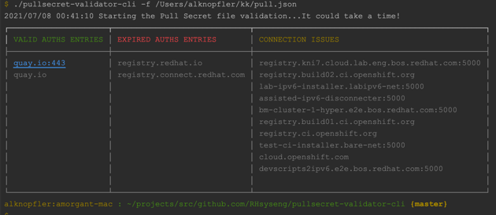

# pullsecret-validator-cli

## Description 

This is a tool to validate the Pull Secret file from the command line interface.

## Install it (Windows/macOS/Linux)

- To Install the binary in your system just get the latest release:

[https://github.com/RHsyseng/pullsecret-validator-cli/releases/latest](https://github.com/RHsyseng/pullsecret-validator-cli/releases/latest)

- Download the file for your OS distribution (Go Binary complied for several OS)
- Unzip the binary into a folder inside your $PATH


## How to Use it

To show the instructions or the help message 
```commandline
./pullsecret-validator-cli -h
```

To validate the pull secret file use the path/filename structure with the -f flag.
**This is the required param. Without -f the program will show you the options.**
```commandline
./pullsecret-validator-cli -f /home/alknopfler/pull-secret.json
```

## Output 
Output formats available:

- table
- json
- yaml

By default the output format is table. If you want to use another one use the -o flag:

```commandline
./pullsecret-validator-cli -f /home/alknopfler/pull-secret.json -o yaml
```

## Output examples:




## Reference

This is the CLI (Command Line Interface) version of the pull secret validator
Also you could use the web version published just only for internal staff


