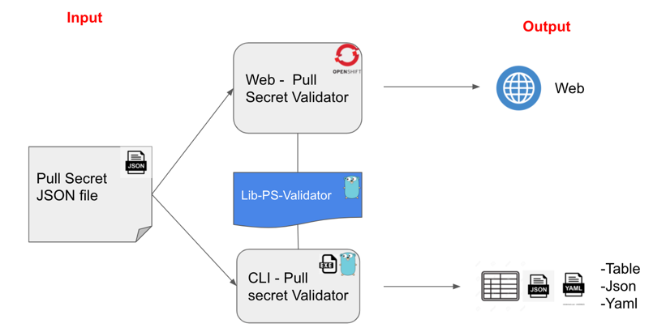

# lib-ps-validator

<a href='https://github.com/jpoles1/gopherbadger' target='_blank'></a>

## Description

**This repository and its contents are completely UNSUPPORTED in any way and are not part of official documentation.**

Lib to validate a pull secret:

- Inputs: [] byte (with the pull secret in json format)
- Output: Struct of interfaces with the information structured in 3 parts:
  - Valid Entries
  - Expired Entries
  - Connection Issues (Sometimes could be an internal registry with some problems to be connected)
  


## How to use it

Just import or get the package using this command:

```
go get github.com/RHsyseng/lib-ps-validator
```

```
import github.com/RHsyseng/lib-ps-validator
```

Main function is: 

```
func Validate(input []byte) WebData 
```
Where the WebData is the model:

```
type WebData struct {
	Input     interface{}
	ResultOK  interface{}
	ResultKO  interface{}
	ResultCon interface{}
}
```

## Which repo are using it:

- pullsecret-validator [https://github.com/RHsyseng/pullsecret-validator](https://github.com/RHsyseng/pullsecret-validator)
- pullsecret-validator-cli [https://github.com/RHsyseng/pullsecret-validator-cli](https://github.com/RHsyseng/pullsecret-validator-cli)

